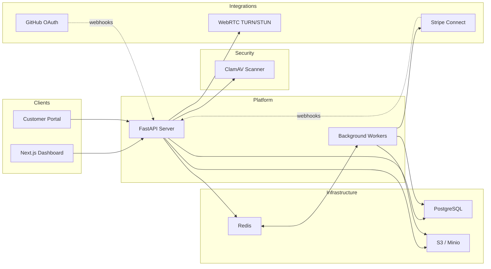

# Developer Guide

Everything you need to build, run, and test Rapidly locally.

## System Overview



## Prerequisites

| Tool | Version | Purpose |
|------|---------|---------|
| [Python](https://www.python.org/downloads/) | 3.14+ | Backend runtime |
| [uv](https://docs.astral.sh/uv/) | latest | Python package manager |
| [Node.js](https://nodejs.org/) | 24+ | Frontend runtime |
| [pnpm](https://pnpm.io/) | latest | JS package manager |
| [Docker](https://docs.docker.com/get-started/) | latest | Infrastructure services |

## Initial Setup

### 1. Environment variables

Bootstrap all required env files in one step:

```sh
./dev/setup-environment
```

This creates `server/.env` and `clients/apps/web/.env.local` with sensible defaults for local development.

**GitHub login** (optional):

```sh
./dev/setup-environment --setup-github-app --backend-external-url https://yourdomain.ngrok.dev
```

Your browser will open to create a GitHub App with pre-filled settings. On Codespaces this is simpler — the script detects the external URL automatically:

```sh
./dev/setup-environment --setup-github-app
```

**Stripe payments** (optional):

1. [Create a Stripe account](https://dashboard.stripe.com/register) and [enable billing](https://dashboard.stripe.com/billing/starter-guide)
2. Copy API keys from [dashboard.stripe.com/test/apikeys](https://dashboard.stripe.com/test/apikeys) into `server/.env`:
   ```
   STRIPE_SECRET_KEY=sk_test_...
   STRIPE_PUBLISHABLE_KEY=pk_test_...
   ```
3. [Add a webhook endpoint](https://dashboard.stripe.com/test/webhooks) pointed at `https://<your-ngrok>.ngrok-free.app/v1/integrations/stripe/webhook` (all events, API version `2026-01-28.clover`) and save the signing secret:
   ```
   STRIPE_WEBHOOK_SECRET=whsec_...
   ```

**Multi-worktree development:**

Secrets are shared across Git worktrees via `~/.config/rapidly/secrets.env`. Run `./dev/setup-environment` once in the primary worktree; subsequent worktrees inherit credentials automatically. Override the path with `RAPIDLY_SECRETS_FILE`.

### 2. Infrastructure services

```sh
cd server
docker compose up -d    # PostgreSQL, Redis, Minio, (optionally ClamAV)
```

### 3. Backend dependencies

```sh
uv sync
```

### 4. Frontend dependencies

```sh
cd clients
pnpm install
```

## Running the Platform

Open separate terminals for each process:

### Backend

```sh
cd server

# Build the email renderer (first time only)
uv run task emails

# Apply database migrations
uv run task db_migrate

# Start the API server (http://127.0.0.1:8000)
uv run task api

# Start background workers
uv run task worker
```

All backend processes auto-restart on code changes.

### Frontend

```sh
cd clients
pnpm dev    # http://127.0.0.1:3000
```

Hot-module replacement is enabled by default via Turbopack.

### First login

1. Navigate to the login page
2. Enter **test@example.com** (or any email — the seeded admin is configured in `server/scripts/seeds_load.py`)
3. Find the OTP code in the terminal running `uv run task api`
4. Enter the code to complete login

## Containerised Development (Alternative)

For a fully Docker-based workflow with hot-reload:

```sh
dev docker up
```

This builds images, starts all infrastructure, installs dependencies, runs migrations, and launches the API + frontend.

| Service | Default port |
|---------|-------------|
| Frontend | 3000 |
| API | 8000 |
| Minio Console | 9001 |

### Parallel instances

Run multiple isolated stacks side-by-side for testing:

```sh
dev docker up -d           # Instance 0: ports 8000/3000
dev docker up -i 1 -d      # Instance 1: ports 8100/3100
dev docker up -i 2 -d      # Instance 2: ports 8200/3200
```

Each instance gets its own Postgres, Redis, and Minio.

### Monitoring (optional)

```sh
dev docker up --monitoring  # Adds Prometheus + Grafana
```

See `dev/docker/.env.docker.template` for all configuration options.

## Testing Apple Pay / Google Pay

These require HTTPS. Use [ngrok](https://ngrok.com/) to tunnel:

```sh
ngrok http 3000
```

Then update:
- `clients/apps/web/.env.local` — set `NEXT_PUBLIC_API_URL` to the ngrok proxy
- `server/.env` — add the ngrok origin to `RAPIDLY_CORS_ORIGINS` and `RAPIDLY_FRONTEND_BASE_URL`
- `clients/apps/web/next.config.mjs` — add `https://*.ngrok-free.dev` to the CSP `connect-src` directive and an API proxy rewrite

> Revert these changes before committing — they are for local testing only.

## Useful Commands

### Backend

| Command | Description |
|---------|-------------|
| `uv run task api` | Start API server with auto-reload |
| `uv run task worker` | Start Dramatiq background workers |
| `uv run task test` | Run test suite with coverage |
| `uv run task test_fast` | Parallel test execution |
| `uv run task lint` | Auto-fix linting (ruff) |
| `uv run task lint_types` | Type checking (mypy) |
| `uv run alembic revision --autogenerate -m "..."` | Create a migration |
| `uv run alembic upgrade head` | Apply pending migrations |

### Frontend

| Command | Description |
|---------|-------------|
| `pnpm dev` | Development server with Turbopack |
| `pnpm build` | Production build |
| `pnpm lint` | ESLint check |
| `pnpm test` | Run tests |
| `pnpm generate` | Regenerate API client from OpenAPI |
| `pnpm typecheck` | TypeScript type checking |
