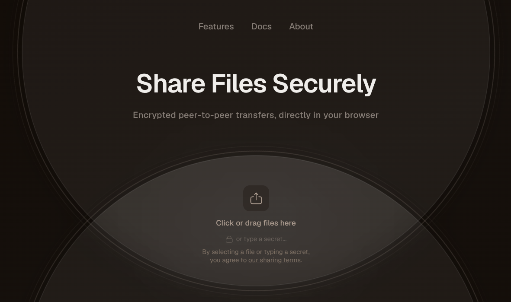

<h1 align="center">Rapidly</h1>
<p align="center"><strong>Secure P2P File-Sharing Platform</strong></p>

<p align="center">
  <a href="https://rapidly.tech">
    
  </a>
</p>

<div align="center">

<a href="https://rapidly.tech">Platform</a>
<span>&nbsp;&nbsp;|&nbsp;&nbsp;</span>
<a href="https://rapidly.tech/docs">Documentation</a>
<span>&nbsp;&nbsp;|&nbsp;&nbsp;</span>
<a href="https://rapidly.tech/docs/api-reference">API</a>
<span>&nbsp;&nbsp;|&nbsp;&nbsp;</span>
<a href="https://reddit.com/r/Rapidly">Community</a>

</div>

---

## What is Rapidly?

Rapidly is an open-source platform for **secure peer-to-peer file sharing**, **paid digital content distribution**, and **encrypted secret exchange**. Files transfer directly between browsers using WebRTC: no server ever sees your data.

- **Share files peer-to-peer**: encrypted transfers happen directly in your browser, with no size limits and zero server storage
- **Monetise shares** with built-in Stripe Connect payments: set a price and get paid instantly
- **Exchange secrets** (API keys, credentials, tokens) via encrypted, self-destructing links
- **Manage access** with organisation-level controls, customer portals, and webhook delivery

### Why Rapidly?

| | Traditional tools | Rapidly |
|---|---|---|
| File sharing | Upload → paste link → hope for the best | P2P in your browser: AES-256 encrypted, no server storage, expiring links, download quotas |
| Sharing secrets | Slack DM / email (!) | Encrypted, one-time-view links with audit trail |

## Getting Started

### Prerequisites

- [Python 3.14+](https://www.python.org/downloads/) and [uv](https://docs.astral.sh/uv/)
- [Node.js 24+](https://nodejs.org/) and [pnpm](https://pnpm.io/)
- [Docker](https://docs.docker.com/get-started/)

### Run locally

```bash
# 1. Clone and configure
git clone https://github.com/rapidly-tech/rapidly.git
cd rapidly
./dev/setup-environment

# 2. Start infrastructure (Postgres, Redis, Minio)
cd server
docker compose up -d

# 3. Backend API (http://127.0.0.1:8000)
uv sync
uv run task db_migrate
uv run task api

# 4. Frontend (http://127.0.0.1:3000) : in a new terminal
cd clients
pnpm install
pnpm dev
```

> **Tip:** For a fully containerised setup with hot-reload, run `dev docker up` from the repo root. See [`DEVELOPMENT.md`](./DEVELOPMENT.md) for details.

## Architecture

Rapidly is a monorepo with a Python/FastAPI backend and a Next.js frontend, connected by a generated TypeScript API client.

```
rapidly/
├── server/                     # Python backend
│   ├── rapidly/                #   Application modules
│   │   ├── file_sharing/       #     File sharing & WebRTC signalling
│   │   ├── storefront/         #     Public share pages
│   │   ├── auth/               #     Authentication (OAuth, magic links)
│   │   ├── organization/       #     Multi-tenant organisation layer
│   │   └── ...                 #     Products, webhooks, notifications, etc.
│   ├── migrations/             #   Alembic database migrations
│   └── docker-compose.yml      #   Dev infrastructure
├── clients/
│   ├── apps/web/               #   Next.js dashboard & public pages
│   └── packages/
│       ├── ui/                 #     Shared component library (Tailwind)
│       ├── client/             #     Generated API client
│       └── customer-portal/    #     Embeddable customer portal SDK
└── dev/                        # Developer tooling & scripts
```

### Key technologies

| Layer | Stack |
|-------|-------|
| API | FastAPI, SQLAlchemy, Pydantic, Dramatiq (workers) |
| Database | PostgreSQL 16, Redis |
| Storage | Cloudflare R2 (S3-compatible, Minio locally) with ClamAV scanning |
| Frontend | Next.js 15, TypeScript, TanStack Query, Tailwind CSS |
| Payments | Stripe Connect |
| Real-time | WebRTC (peer-to-peer file transfers), Server-Sent Events |

## Pricing

- **Free** for file sharing and secret exchange
- **5 % platform fee** on paid shares (via Stripe): no monthly costs
- See the [fee schedule](https://rapidly.tech/docs/policies/fees) for full details

## Contributing

We welcome contributions of all kinds: bug reports, feature requests, docs improvements, and code.

1. Read [`DEVELOPMENT.md`](./DEVELOPMENT.md) for environment setup
2. Check [open issues](https://github.com/rapidly-tech/rapidly/issues) or propose a new one
3. Fork, branch, and open a pull request

### Security

Found a vulnerability? Please disclose it responsibly: see [`SECURITY.md`](./SECURITY.md).

## Community

- [Reddit](https://reddit.com/r/Rapidly): questions, ideas, and chat
- [GitHub Discussions](https://github.com/rapidly-tech/rapidly/discussions): longer-form conversations
- [X](https://x.com/rapidly_tech): announcements

## Licence

Licensed under the [Apache License 2.0](https://www.apache.org/licenses/LICENSE-2.0).
